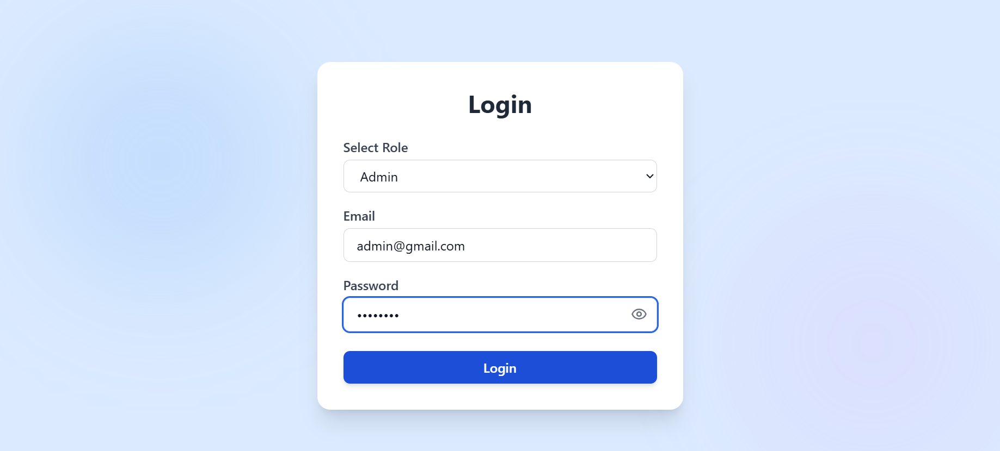
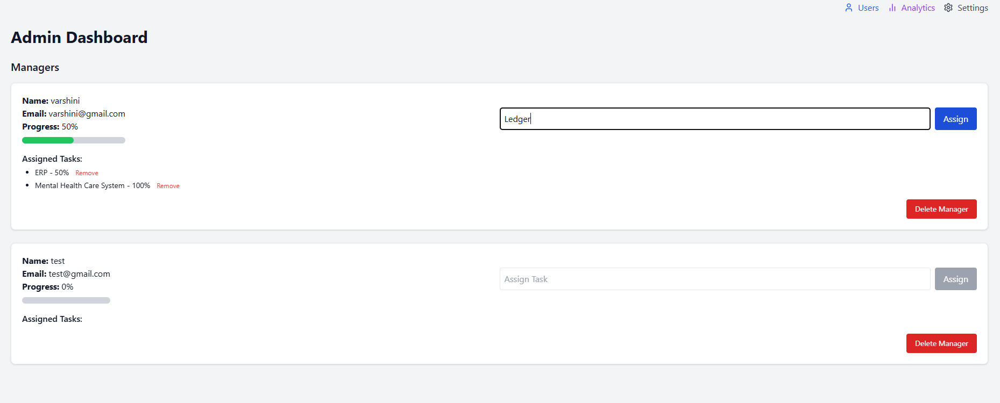
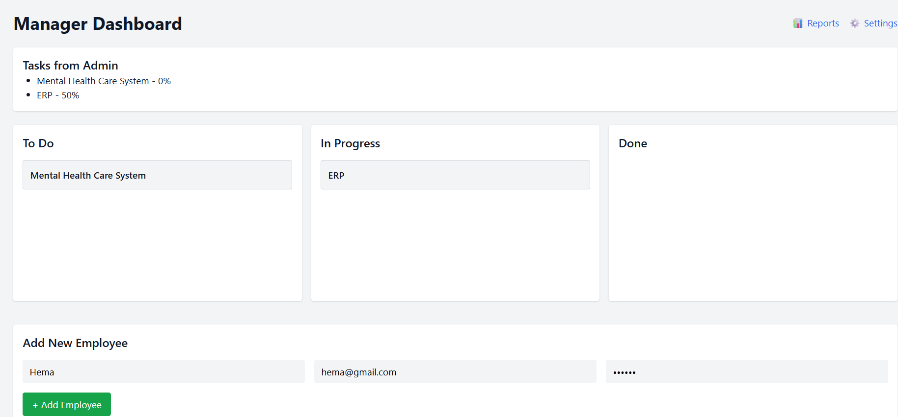
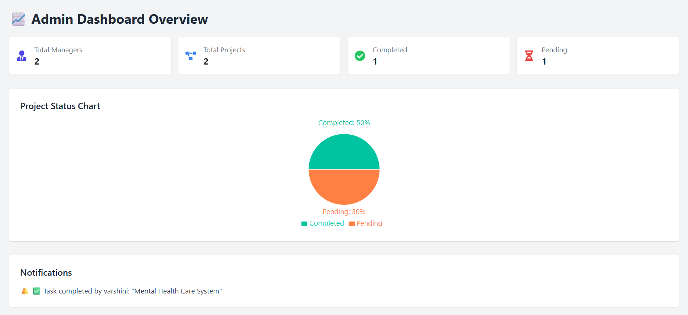
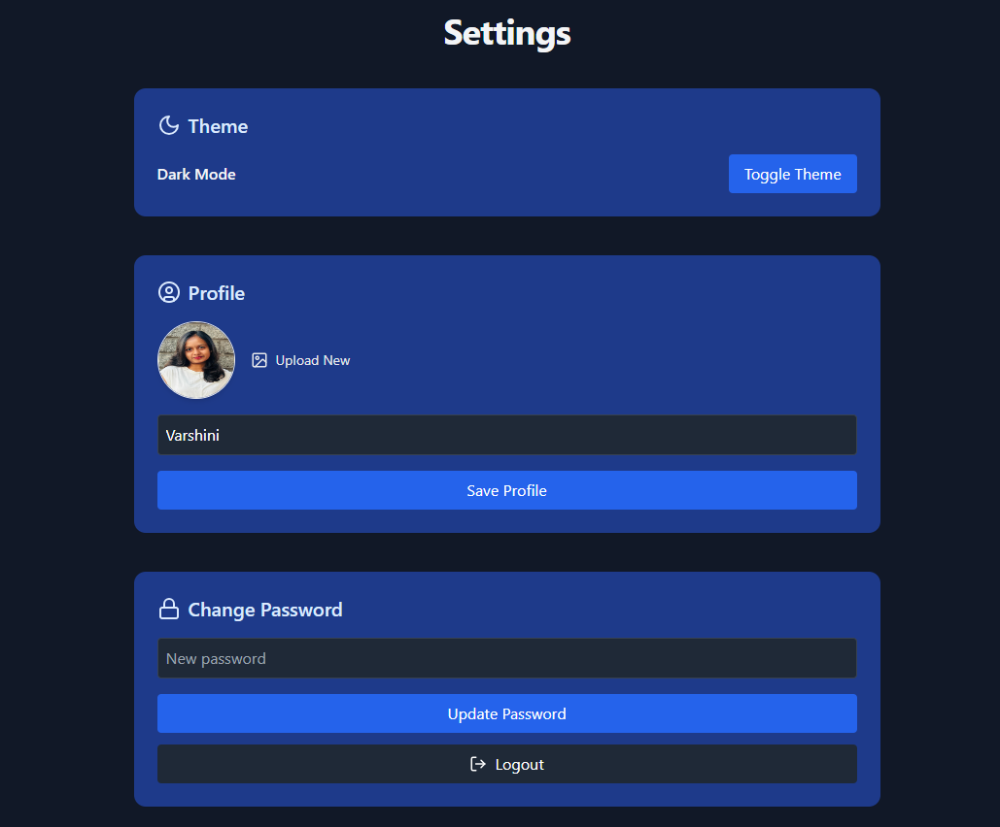

# 🏢 EMS - Enterprise Management System

A web-based role-driven task and employee management platform for organizations to streamline their internal operations. EMS allows Admins to onboard Managers, who in turn manage Employees and assign tasks through a clean, intuitive interface.

---

## 🔗 Hosted App

👉 [Access EMS Here](https://e-m-system.netlify.app)  

---

## 🔐 Login Credentials

Use these credentials to test the app or create new users via the Admin panel.

| Role     | Email              | Password     |
|----------|--------------------|--------------|
| Admin    | `admin@gmail.com`    | `admin123`   |
| Manager  | *(added from admin)* | *your pass*  |
| Employee | *(added from manager)* | *your pass*|

---

## ⚙️ Features

- 🎭 **Role-Based Login**: Admin / Manager / Employee
- 👩‍💼 **Admin Dashboard**: Add managers, view all users
- 👨‍💼 **Manager Dashboard**: Add employees, assign/manage tasks
- ✅ **Employee Interface**: View assigned tasks
- 📦 **Kanban Board**: Drag-and-drop task progression (To Do → In Progress → Done)
- 📝 **Task Metadata**: Deadlines, priorities, comments
- 🎨 **Global Theme Toggle**: Light/Dark (affects all users)
- 🙍 **User Settings**: Avatar, name, password update
- 💾 **Data Persistence**: All data stored in `localStorage`

---
## 📦 Libraries & Dependencies

These are the key libraries used in the EMS project:

- [`react-router-dom`](https://reactrouter.com/) – Routing
- [`tailwindcss`](https://tailwindcss.com/) – Utility-first styling
- [`lucide-react`](https://lucide.dev/) – Icon set
- [`@hello-pangea/dnd`](https://github.com/hello-pangea/dnd) – Drag and drop Kanban board
- [`uuid`](https://www.npmjs.com/package/uuid) – Unique ID generation

---
## 🛠️ Tech Stack

- **Frontend:** React + Vite  
- **Routing:** React Router DOM  
- **Styling:** Tailwind CSS  
- **Icons:** Lucide React  
- **Drag and Drop:** @hello-pangea/dnd  
- **Unique IDs:** uuid  
- **State Management:** React Hooks + localStorage  
---
## 🖼️ Screenshots

### 🔐 Login Page


### 👤 Admin Dashboard


### 📋 Manager Dashboard


### 🧾 Reports


### ⚙️ Settings Page


---
## 🧪 How to Test / Workflow

1. **Login as Admin**
   - Email: `admin@ems.com`
   - Password: `admin123`
   - ➕ Add a new Manager from Admin Dashboard

2. **Login as Manager**
   - Use manager credentials created above
   - ➕ Add employees under your management
   - 📝 Assign tasks with due date, priority, and comments
   - 📦 Use drag-and-drop Kanban board for tracking

3. **Login as Employee**
   - Use employee credentials created by manager
   - 👀 View assigned tasks and track status (read-only)

4. **Settings Page**
   - ⚙️ Change theme (dark/light)
   - 📤 Upload profile image
   - ✏️ Update name and password

---

## 🚀 How to Run Locally

```bash
git clone https://github.com/Varshini-Kulkarni22/EMS.git
cd ems

npm install
npm run dev

